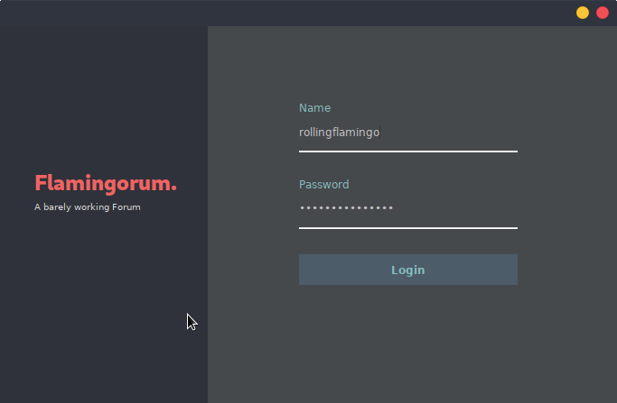

# RMIForum
Simple Java based Forum

This is a Work in progress, stay tuned
## RMIServer API
```java
// Exportable Methods:
boolean ManageConnection(String username, String pw, String adress, String op);
boolean ManageAddTopic(String TopicLabel, String TopicOwner);
boolean ManageSubscribe(String TopicLabel, String User, boolean unsubscribe);
boolean ManagePublish(MessageClass msg, String TopicLabel);

// Local Methods:
void Notify(String TopicLabel, String TriggeredBy, boolean type);
void start();
void shutDown();
void printInfo();
```
## RMIClient API
```java
// Exportable Methods:
void CliNotify(String TopicLabel, String TriggeredBy, boolean type);

// Local Methods:
boolean ConnectionRequest(String SererverHost, String User, String pw, String op);
boolean AddTopicRequest(String TopicLabel);
boolean SubscribeRequest(String TopicLabel, String op);
boolean PublishRequest(MessageClass msg, String TopicLabel);
```
## Appearance



Maybe, one day, we'll manage to make this thing work...
